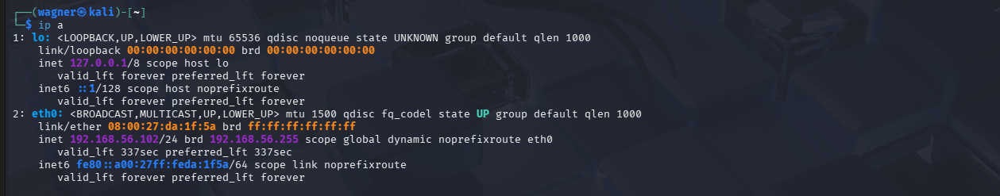
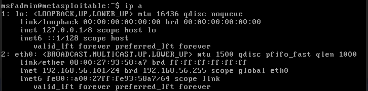
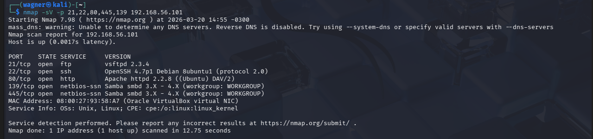
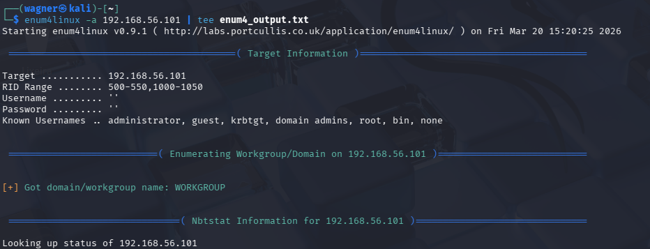
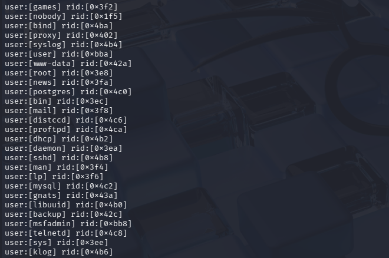
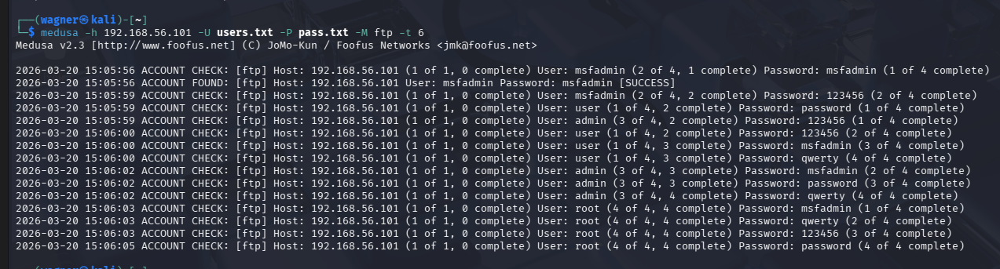
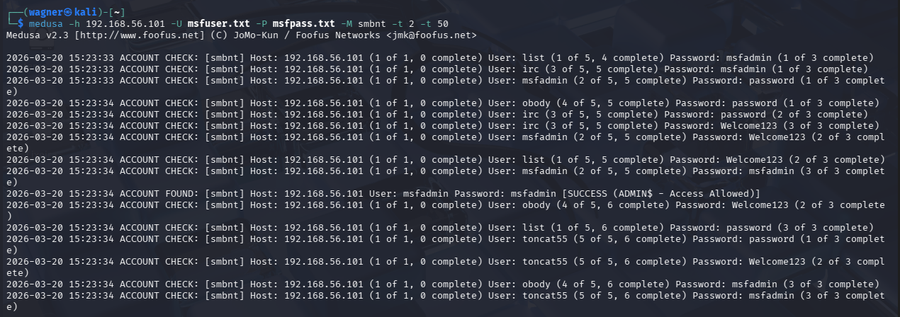
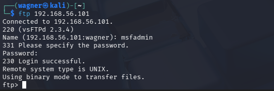

# 🛡️ Simulação de Ataque de Brute Force (Pentest Lab)
### Ferramentas: Kali Linux | Medusa | Protocolos: FTP, SMB, HTTP

## 📝 Descrição do Projeto
Este projeto documenta um laboratório de **Ethical Hacking** realizado em ambiente controlado. O objetivo foi testar a robustez de senhas e a vulnerabilidade de serviços comuns (FTP e SMB) contra ataques de força bruta utilizando a ferramenta **Medusa**.

> **⚠️ Aviso Ético:** Este laboratório foi realizado exclusivamente para fins educacionais e de aprendizado em cibersegurança, utilizando máquinas próprias em rede isolada.

## 🛠️ Stack Técnica
* **OS:** Kali Linux (Atacante)
* **Target:** Máquina com serviços FTP, SMB e formulários web (DVWA).
* **Tool:** Medusa (Modular Exhaustive Disk User Password Guessing Sever).
* **Wordlists:** Rockyou.txt e listas personalizadas.

## 🚀 Cenários de Teste
1. **Brute Force em FTP:** Tentativa de autenticação modular em servidor de arquivos.
2. **Brute Force em SMB:** Teste de vulnerabilidade em compartilhamento de rede.
3. **Formulários Web:** Simulação de ataque em tela de login (DVWA).

## 🔍 Metodologia Aplicada
O ataque foi estruturado seguindo as etapas de um Pentest:
1. **Reconhecimento:** Identificação de portas abertas e serviços rodando.
2. **Exploração:** Execução do Medusa com sintaxe otimizada:
   `medusa -h [IP_ALVO] -u [USUARIO] -P [WORDLIST] -M ftp`
3. **Análise de Resultados:** Verificação do tempo de resposta e eficácia da wordlist.

## 🛡️ Como Mitigar (O que aprendi)
Como defensor, este laboratório provou a necessidade de:
* **Políticas de Senhas Fortes:** Senhas curtas foram quebradas em segundos.
* **Fail2Ban:** Implementação de bloqueio de IP após X tentativas falhas.
* **MFA (Autenticação de Dois Fatores):** A maior barreira contra brute force.

## 🌐 Configuração do Ambiente de Rede

A primeira etapa foi garantir o isolamento das máquinas em uma rede Host-only no VirtualBox para assegurar que nenhum tráfego de teste saísse para a internet.

* **Kali Linux:** Configurou a interface `eth0` com o IP `192.168.56.102/24`.

  
   <em>Figura 1: Validação do endereço IP da máquina atacante via terminal do Kali.</em>

* **Metasploitable 2:** A máquina alvo recebeu o IP `192.168.56.101/24` na interface `eth0`.

  
   <em>Figura 2: Validação do endereço IP da máquina alvo Metasploitable 2.</em>

## 🔍 Reconhecimento e Exploração

Com o laboratório montado, iniciou-se o ciclo de Pentest.

### Fase 2a: Reconhecimento com Nmap

Utilizou-se o Nmap para descobrir quais portas e serviços estavam abertos no alvo. O comando especificou as portas mais comuns para ataques de força bruta: 21 (FTP), 22 (SSH), 80 (HTTP), 139 e 445 (SMB).

* **Comando:** `nmap -sV -p 21,22,80,445,139 192.168.56.101`

  
   <em>Figura 3: Resultado do Nmap mostrando os serviços FTP (vsftpd 2.3.4) e SMB (Samba) abertos.</em>

### Fase 2b: Enumeração SMB com Enum4Linux

Sabendo que o SMB estava rodando, utilizou-se o **Enum4Linux** para extrair informações mais detalhadas sobre o alvo, incluindo a estrutura do sistema operacional e, crucialmente, uma lista de usuários válidos.

  
   <em>Figura 4: Início da execução do Enum4Linux contra o IP 192.168.56.101.</em>

  
   <em>Figura 5: Lista de usuários extraídos do alvo, incluindo 'nobody', 'root', e 'msfadmin'. Essa lista é fundamental para criar wordlists personalizadas e eficazes.</em>

---

## 🚀 Execução dos Ataques de Força Bruta

Com usuários e serviços identificados, preparou-se os ataques de força bruta utilizando o **Medusa**.

### Cenário 3a: Ataque de Credenciais Cruzadas no FTP

Neste cenário, utilizou-se uma lista de usuários (`users.txt`) contra uma lista de senhas (`pass.txt`) no protocolo FTP. O Medusa testou todas as combinações cruzadas.

* **Comando:** `medusa -h 192.168.56.101 -U users.txt -P pass.txt -M ftp -t 6`
* **Observação:** O parâmetro `-t 6` foi usado para paralelismo moderado, evitando sobrecarregar o serviço.

  
   <em>Figura 6: O Medusa identificou credenciais válidas. Notavelmente, 'msfadmin'/'msfadmin', um exemplo claro de credenciais padrão fracas.</em>

### Cenário 3b: Password Spraying no SMB (Samba)

Neste teste, utilizou-se a técnica de Password Spraying, testando uma única senha fraca contra múltiplos usuários.

* **Comando:** `medusa -h 192.168.56.101 -U msfuser.txt -P msfpass.txt -M smbnt -t 2 -t 50`

  
   <em>Figura 7: O Medusa validou credenciais via SMB.</em>

---

## ✅ Validação de Acesso

O sucesso do teste não está apenas no terminal do Medusa, mas na prova de que o acesso é funcional.

### Validação via FTP

Para confirmar, logou-se manualmente no serviço FTP utilizando as credenciais 'msfadmin'/'msfadmin' encontradas pelo Medusa.

  
   <em>Figura 8: Login FTP manual bem-sucedido, provando a eficácia do ataque.</em>

 ## ⚠️ Desafios Técnicos: Automação Web (DVWA)
Durante o desafio, foi realizada uma tentativa de ataque de força bruta contra o formulário de login do **DVWA**. No entanto, a ferramenta Medusa apresentou instabilidades e não conseguiu validar as credenciais corretamente, mesmo com a segurança da aplicação configurada no nível "Low".

**Análise do Problema:**
* **Gestão de Sessão:** Formulários Web modernos (mesmo os deliberadamente vulneráveis) dependem de Cookies de sessão e, por vezes, tokens de segurança que o Medusa, por ser uma ferramenta de força bruta de protocolos mais "estáticos" (como FTP/SMB), pode ter dificuldade em processar de forma síncrona.
* **Complexidade do Módulo HTTP:** O módulo `http` do Medusa exige uma sintaxe muito específica para o envio de parâmetros POST, e qualquer pequena atualização na estrutura do DOM do DVWA pode causar falhas na identificação da string de erro/sucesso.

---

## 🧠 Conclusão e Reflexões Finais

A execução deste desafio proporcionou uma visão realista de um cenário de *Pentest*. Mais do que apenas rodar comandos, o processo exigiu análise crítica e adaptação.

**Principais Aprendizados:**
1. **Ferramenta Certa para o Trabalho Certo:** O Medusa demonstrou uma performance excepcional e extrema rapidez em protocolos de rede como **FTP** e **SMB**. No entanto, ao lidar com a camada de aplicação (Web), ficou claro que ferramentas especializadas em interceptação e automação HTTP (como o **Burp Suite** ou **OWASP ZAP**) seriam mais resilientes para lidar com variáveis como cookies e sessões.
2. **A Importância da Enumeração:** O sucesso dos ataques de força bruta foi diretamente proporcional à qualidade da fase de reconhecimento. O uso do **Enum4Linux** para extrair nomes reais de usuários reduziu drasticamente o "ruído" do ataque e o tempo de execução.
3. **Resiliência e Troubleshooting:** A dificuldade encontrada no ataque ao DVWA foi um dos pontos mais produtivos do desafio. Entender que atualizações de segurança ou mudanças na estrutura da aplicação podem quebrar scripts de automação é fundamental para qualquer profissional de segurança. Isso reforça que o *Pentest* não é um processo mecânico, mas um ciclo constante de tentativa, erro e ajuste técnico.

Este projeto reforça a necessidade de uma defesa em camadas: não basta ter senhas fortes se o protocolo (FTP) é inseguro, e não basta ter um protocolo seguro se as credenciais padrão não forem alteradas.

### 👨‍💻 Autor

Desenvolvido por **Wagner Soares**.
* **Formação:** Estudante de Bacharelado em Sistemas de Informação.
* **Interesses:** Python, Data Science, Flutter e Segurança Cibernética.
